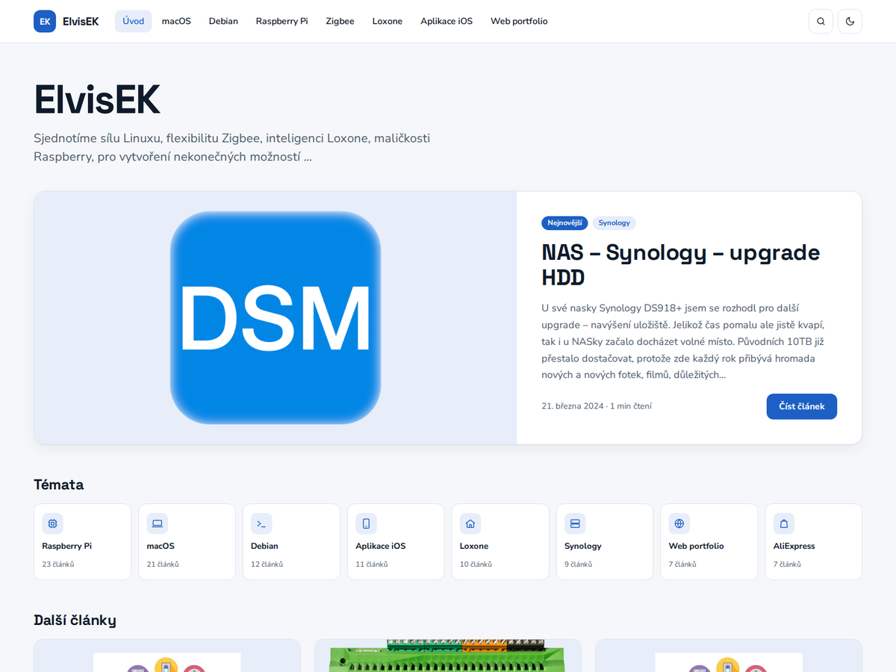

# ElvisEK — WordPress šablona a plugin

[](https://github.com/elvisek2020/wp-theme_elvisek/releases/latest)


Vlastní šablona a doprovodný plugin pro technický blog [www.elvisek.cz](https://www.elvisek.cz) — rychlé, bez jQuery, bez build kroku a bez externích služeb. Navrženo pro dlouhé návody s ukázkami kódu.



| Balíček | Typ | Popis |
|---|---|---|
| **ElvisEK** (`theme/elvisek`) | šablona | vzhled webu: titulka, články, rubriky, komentáře |
| **ElvisEK Core** (`plugins/elvisek-core`) | plugin | funkce nezávislé na šabloně: bezpečnost, obrázky, SEO, údržba |

Obojí se vydává společně se stejným číslem verze a aktualizuje se přímo z GitHub Releases.

---

## Šablona ElvisEK

**Vzhled**
- Světlý a tmavý režim (Systém / Světlý / Tmavý) a volba šířky stránky v patičce, pamatuje si je prohlížeč
- Titulka v magazínovém stylu: nadpis s mottem a obrázkem (zvlášť pro světlý a tmavý režim), hlavní článek a mřížka karet
- Dlaždice témat v hlavičce, které se při rolování změní v kompaktní lištu; když se témata nevejdou, nabídnou se v hamburger menu
- Rychlé hledání v hlavičce a „Načíst další“ místo stránkování
- Jemný barevný podtón podle rubriky (štítky, dlaždice, proužek na kartě)
- Instalovatelný web (PWA): přečtené články jdou otevřít i offline
- Vlastní stránka 404 s hledáním a nejnovějšími články

**Články**
- Obsah článku (TOC) z nadpisů a volitelný boční panel s novinkami
- Bloky kódu se zvýrazněním syntaxe (PrismJS), čísly řádků, tlačítkem Kopírovat a volitelným názvem souboru nad kódem; styl „Výstup“ pro výstup z terminálu, sbalení kódu nad 30 řádků a klávesy (`<kbd>`); dvě šířky podle délky kódu
- Box „Ve zkratce“ z pole v nastavení článku
- Blok GitHub repozitář (karta s posledním vydáním, data z API s cache na serveru)
- Obrázky jednotně na 800 px a prohlížeč obrázků (lightbox) se šipkami
- Štítek „Aktualizováno“ u zrevidovaných návodů (datum se zadává v editoru)
- Obrázek rubriky jako náhled u článků bez vlastního obrázku
- Související články, tisková verze a komentáře ve sbaleném boxu s kompaktním formulářem
- Tlačítko Nahoru

**Technicky**
- Hybridní šablona: PHP šablony a `theme.json`, moduly v `inc/` jdou vypnout jednotlivě
- Fonty (Nunito Sans, Space Grotesk, JetBrains Mono) i zvýrazňovač kódu jsou lokálně, žádné CDN
- SEO: meta description, Open Graph, Twitter karty, JSON-LD, kanonické URL
- Google Analytics 4 s vlastní cookie lištou — načte se jen se souhlasem a jen když je vyplněné ID
- Antispam komentářů (honeypot a časová kontrola) bez reCAPTCHA

**Nastavení** — *Vzhled → Přizpůsobit*

| Sekce | Volby |
|---|---|
| Úvodní stránka | nadpis s mottem, obrázek hlavičky (světlý / tmavý), výběr a pořadí témat, počet témat |
| Články | boční panel (obsah článku, novinky), čísla řádků u kódu, odkazy Starší / Novější, režim obrázku rubriky |
| Patička | text o webu, rok založení |
| SEO | meta description titulky, Google Analytics 4 ID |

Obrázek rubriky se nastavuje v *Příspěvky → Rubriky*.

---

## Plugin ElvisEK Core

Nahrazuje sedm dřívějších pluginů a funguje nezávisle na šabloně.

| Oblast | Co dělá |
|---|---|
| Přihlášení | omezení pokusů o přihlášení, log přihlášení, poslední přihlášení uživatelů |
| Bezpečnost | hardening WordPressu, bezpečnostní HTTP hlavičky, přesměrování autorských stránek |
| Obrázky | PNG/JPG se při nahrání uloží rovnou jako WebP (fotky se otočí podle EXIF), zmenšeniny ve WebP |
| SEO | sitemap s datem změny a bez uživatelů, `/llms.txt` |
| Média | další povolené typy souborů ke stažení |
| Aktualizace | automatické aktualizace WordPressu a pluginů, aktualizace šablony i pluginu z GitHubu |
| Admin | informace o serveru v patičce administrace |
| Nástěnka | widget Zdraví webu: verze a aktualizace, velikost DB / autoload / uploads, koncepty, komentáře, poslední údržba |

**Údržba webu** — *Nástroje → Údržba webu*
- Sjednocení starších obrázků na WebP: převede soubory i odkazy v obsahu, staré adresy přesměruje (301)
- Přehled databáze (velikost tabulek, autoload) a optimalizace
- Největší soubory, nepoužité obrázky s hromadným mazáním a rozbité interní odkazy
- Úklid revizí, konceptů, koše a expirovaných transientů

---

## Požadavky

- WordPress 6.6+ (testováno do 7.1)
- PHP 8.1+ s podporou WebP v GD nebo Imagick

## Instalace

1. Stáhněte `elvisek.zip` a `elvisek-core.zip` z [posledního vydání](https://github.com/elvisek2020/wp-theme_elvisek/releases/latest).
2. *Vzhled → Motivy → Přidat nový → Nahrát motiv* → `elvisek.zip` → Aktivovat.
3. *Pluginy → Přidat nový → Nahrát plugin* → `elvisek-core.zip` → Aktivovat.

## Aktualizace

Šablona i plugin si nové vydání najdou samy. Stačí *Nástěnka → Aktualizace → Zkontrolovat znovu* a aktualizovat.

---

## Vývoj

```
theme/elvisek/            šablona (podrobnosti v theme/elvisek/README.md)
plugins/elvisek-core/     plugin
mu-plugins/               pomůcky jen pro lokální vývoj — nenasazovat
dev/                      lokální WordPress v Dockeru (dev/README.md)
tools/                    wp.py (REST API klient), img.py (příprava obrázků)
.github/workflows/        sestavení vydání
```

**Lokální prostředí** — WordPress v Dockeru na `http://localhost:8080`, šablona a plugin jsou do kontejneru připojené přímo z repozitáře (bez kopírování). Návod v [`dev/README.md`](dev/README.md).

**Nástroje**

```bash
# WordPress REST API – články jen jako koncepty, publikuje člověk
python3 tools/wp.py whoami | categories | drafts | posts | pages | media
python3 tools/wp.py draft --title "…" --content clanek.html --categories 15 --tags "docker,rpi" [--featured obrazek.webp]
python3 tools/wp.py upload obrazek.webp --alt "…"

# Obrázky: obrazky/vstup → obrazky/web (1600×900, WebP)
python3 tools/img.py
```

Přístupové údaje čte `wp.py` z `ctime.txt`, který je v `.gitignore`.

## Vydání nové verze

Šablona i plugin mají společnou verzi.

1. Zvyšte `Version:` v `theme/elvisek/style.css` **i** v `plugins/elvisek-core/elvisek-core.php` a doplňte [`CHANGELOG.md`](CHANGELOG.md).
2. Commit a anotovaný tag:
   ```bash
   git add -A && git commit -m "X.Y.Z: …"
   git status                      # musí být čisto
   git tag -a vX.Y.Z -m "X.Y.Z" && git push && git push --tags
   ```
3. GitHub Action ověří, že tag odpovídá verzím, zkontroluje syntaxi PHP, sestaví `elvisek.zip` a `elvisek-core.zip` a vytvoří Release.

## Licence

[GPL-2.0-or-later](https://www.gnu.org/licenses/gpl-2.0.html) · © Zdeněk Král ([ElvisEK](https://www.elvisek.cz))
